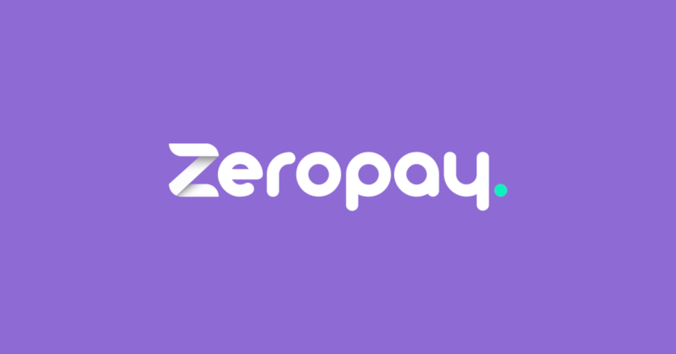

# Project Trello develope with NodeJS and React
A project based on


### Software develop by Gilberto Souza



### Installation
Clone this repository and install dependency with `yarn install` or `npm install`
```sh
$ cd zeropay_trello
$ yarn install
$ yarn start or npm start
```
### Run Test

```sh
$ yarn test
```


